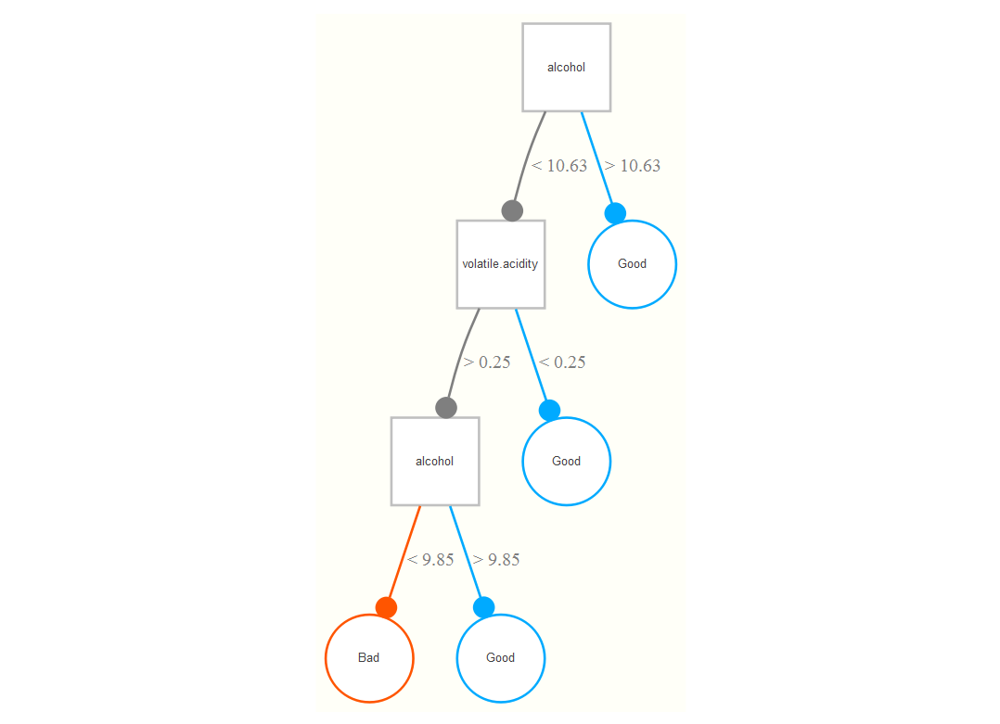
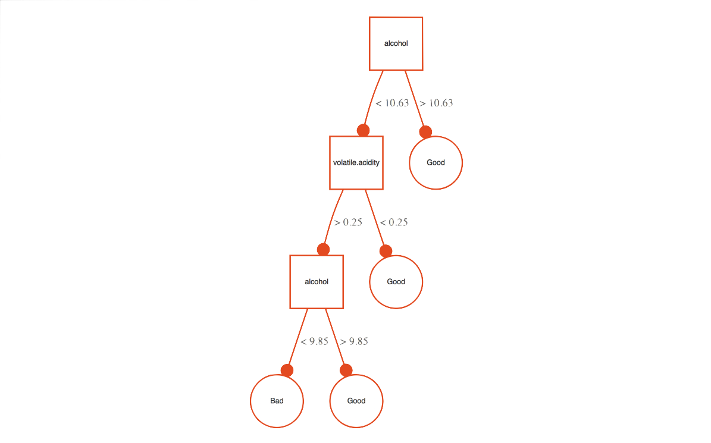
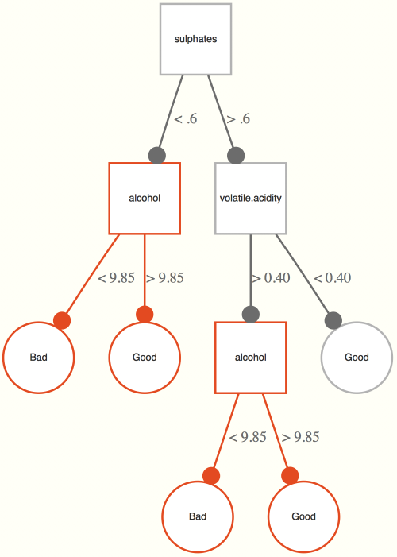

# Opening the Black Box

<span class="newthought">It's now time to see some machine learning in action</span>. In what follows, a variety of techniques will be used on the same problem to provide a better feel for the sorts of tools that are available.

## Process Overview

Despite the facade of a polished product one finds in published research, most of the approach with the statistical analysis of data is full of data preparation, starts and stops, debugging, re-analysis, tweaking and fine-tuning etc. Statistical learning is no different in this sense.  Before we begin with explicit examples, it might be best to give a general overview of the path we'll take.


### Data Preparation

As with any typical statistical project, probably most of the time will be spent preparing the data for analysis.  Data is never ready to analyze right away, and careful checks must be made in order to ensure the integrity of the information.  This would include correcting errors of entry, noting extreme values, possibly imputing missing data and so forth.  In addition to these typical activities, we will discuss a couple more things to think about during this initial data examination when engaged in machine learning.


#### Define Data and Data Partitions

As we have noted previously, ideally we will have enough data to incorporate some validation procedure. This would be some random partition of the data such that we could safely conclude that the data in the test set comes from the same population as the training set. The validation set is used to fit the initial models at various tuning parameter settings, with a 'best' model being that which satisfies some criterion.  With final model and parameters chosen, generalization error will be assessed with the performance of the chosen model on the test data.

In addition, when data is too large to fit in memory, it will possibly need to be partitioned regardless of the modeling scenario. Spark, Hadoop and other frameworks allow for analysis of data that is potentially distributed across several machines or cores within a machine.


#### Feature Scaling

Even with standard regression modeling, centering continuous variables (subtracting the mean) is a good idea so that intercepts and zero points are meaningful. Standardizing variables so that they have similar variances or ranges will help some procedures find their maximums/minimums faster.  Another common transformation is *min-max* normalization[^minmax], which will transfer a scale to a new one of some chosen minimum and maximum.  Note that whatever approach is done, it must be done *after* any explicit separation of data.  So if you have separate training and test sets, they should be scaled separately. Of course, with enough data and appropriate partitioning, it shouldn't matter.


#### Feature Engineering

If we're lucky we'll have ideas on potential combinations or other transformations of the predictors we have available.  For example, in typical social science research there are two-way interactions one is often predisposed to try, or perhaps one can sum multiple items to a single scale score that may be more relevant.  Another common technique is to use a dimension reduction scheme such as principal components, but this can (and probably should) actually be implemented as part of the ML process[^pcr].  However, many techniques are fine with more predictors than observations, even some still do well if many of them are irrelevant.

One can implement a variety of such approaches in ML to create additional potentially relevant features, as well, even automatically. As a reminder though, a key concern is overfitting, and doing broad construction of this sort with no contextual guidance would potentially be prone to such a pitfall.  In other cases, it may simply be not worth the time expense.


#### Discretization

While there may be some contextual exceptions to the rule, it is generally a pretty bad idea in standard statistical modeling to discretize/categorize continuous variables[^discretize2].  However, some ML procedures will work better (or just notably faster) if dealing with discrete valued predictors rather than continuous. Others even require them; for example, *logic regression* needs binary input.  While one could pick arbitrary intervals and cut-points in an unsupervised fashion, such as picking equal range bins or equal frequency bins, there are supervised approaches that will use the information in the data to produce some 'optimal' discretization.

It's generally not a good idea to force things in data analysis, and given that a lot of data situations will contain mixed data types, it seems easier to simply apply some scaling to preserve the inherent relationships in the data.  Again though, if one has only a relative few continuous variables, or a context in which it makes sense to, it's probably better to leave continuous variables as such.


### Model Selection

With data prepared and ready to analyze, one can use a validation process to come up with a viable model.  Use an optimization procedure or a simple grid search over a set of specific values to examine models at different tuning parameters. Perhaps make a finer search once an initial range of good performing values is found, though one should not split hairs over arbitrarily close performance.  Select a 'best' model given some criterion such as overall accuracy, or if concerned about over fitting, select the simplest model within one standard error of the accuracy of the best, or perhaps the simplest within X% of the best model.  For highly skewed classes, one might need to use a different measure of performance besides accuracy, as simply guessing the most common category could lead to very high accuracy.  If one has a great many predictor variables, one may use the model selection process to select features that are 'most important'.


### Model Assessment

With tuning parameters/features chosen, we then examine performance on the independent test set (or via some validation procedure). For classification problems, consider other statistics besides accuracy as measures of performance, especially if classes are unbalanced. Consider other analytical techniques that are applicable and compare performance among the different approaches.  One can even combine disparate models' predictions to possibly create an even better classifier[^ensemble].

#### Regression

In typical model comparison within the standard linear model framework, there are a number of ways in which we might assess performance across competing models.  For standard OLS regression we might examine adjusted-$R^2$ or a statistical test with nested models, or with the generalized linear models we might pick a model with the lowest AIC[^aic].  As we have already discussed, in the machine learning context we are interested in models that reduce e.g. squared error loss (regression) or misclassification error (classification).  However, in dealing with many models some differences in performance may be arbitrary.

#### Beyond Classification Accuracy: Other Measures of Performance

In typical classification situations we are interested in overall accuracy.  There are situations however, not uncommon, in which simple accuracy isn't a good measure of performance.  As an example, consider the prediction of the occurrence of a rare disease. Guessing a non-event every time might result in 99.9% accuracy, but that isn't how we would prefer to go about assessing some classifier's performance.
To demonstrate other sources of classification information, we will use the following 2x2 table that shows values of some binary outcome (0 = non-event, 1 = event occurs) to the predictions made by some model for that response (arbitrary model).  Both a table of actual values, often called a <span class="emph">confusion matrix</span>[^confusion], and an abstract version are provided.


<!-- between the combined failure of pander datatable and div in tufte (ignores width and other); a 3 coloumn hack gets clean tables side by side via a ghosted third column but still may screw up.  Keeping latex for now: see # see https://stackoverflow.com/questions/38386808/render-latex-tables-in-html-using-rmarkwown -->


```{r confusionMatrix_old, echo=F, eval=FALSE}
tex2markdown = function(texstring) {
  writeLines(text = texstring,
             con = myfile <- tempfile(fileext = ".tex"))
  texfile = knitr::pandoc(input = myfile, format = "html")
  cat(readLines(texfile), sep = "\n")
  unlink(c(myfile, texfile))
}

# freqs = matrix(c('', '', '', 'Actual',
#                  '', '', '1', '0', 
#                  'Predicted', '1', '41','21',
#                  '', '0', '16','13'), 4, 4, byrow=T)
# lets = matrix(c('', '', '', 'Actual',
#                  '', '', '1', '0', 
#                  'Predicted', '1', 'A','B',
#                  '', '0', 'C','D'), 4, 4, byrow=T)
# lets = data.frame(lets)
# colnames(lets) = c('','','','')
# 
# library(DT)
# datatable(freqs,  options=list(dom='t', 
#                              ordering=F, 
#                              columnDefs = list(list(className = 'dt-right', targets = 1:3))), 
#           width='35%', colnames=rep('', 4), rownames=F) %>% 
#   formatStyle(columns=1:4, backgroundColor='#fffff8')
# 
# htmltools::br()
# 
# datatable(lets, options=list(dom='t', 
#                              ordering=F, 
#                              columnDefs = list(list(className = 'dt-right', targets = 1:3))), 
#           width='35%', colnames=rep('', 4), rownames=F) %>% 
#   formatStyle(columns=1:4, backgroundColor='#fffff8')  # only way to remove the idiotic row coloring
# 
# htmltools::br();htmltools::br();htmltools::br();htmltools::br(); htmltools::br()
# htmltools::br();htmltools::br();htmltools::br();htmltools::br(); htmltools::br()


```


```{r confusionMatrix, echo=FALSE}
t1 = data_frame(` ` = c('Predicted = 1','Predicted = 0'),
           `Actual = 1` = c(41, 16),
           `Actual = 0` = c(21, 13))
t2 = data_frame(` ` = c('Predicted = 1','Predicted = 0'),
           `Actual = 1` = c('A', 'C'),
           `Actual = 0` = c('B', 'D'))

kable(list(t1, t2), format='html', align='cc') %>% 
  kable_styling(full_width = T, bootstrap_options = 'basic')
```


<!-- <br> -->
<!-- <div class="col2"> -->
<!-- |   | Actual = 1  | Actual = 0  | -->
<!-- |:-:|:-:|:-:| -->
<!-- | Predicted = 1  | 41 | 21 | -->
<!-- | Predicted = 0  | 16 | 13 | -->


<!-- |   | Actual = 1  | Actual = 0  | -->
<!-- |:-:|:-:|:-:| -->
<!-- | Predicted = 1  | A | B | -->
<!-- | Predicted = 0  | C | D | -->
<!-- </div> -->

```{r confmat_values, echo=FALSE}
A = 41
B = 21
C = 16
D = 13
# truepos_total = A + C
# pospred_total = A + B
# trueneg_total = B + D
# negpred_total = C + D
Total = A + B + C + D
```

<br>

<span class="emph">True Positive</span>, <span class="emph">False Positive</span>, <span class="emph">True Negative</span>, <span class="emph">False Negative</span>: Above, these are A, B, D, and C respectively.

<span class="emph">Accuracy</span>: Number of correct classifications out of all predictions ((A+D)/Total). In the above example this would be (41+13)/91, about `r round((A+D)/Total,2)*100`%.

<span class="emph">Error Rate</span>: 1 - Accuracy.

<span class="emph">Sensitivity</span>: is the proportion of correctly predicted positives to all true positive events: A/(A+C).  In the above example this would be 41/57, about `r round(A/(A+C),2)*100`%. High sensitivity would suggest a low type II error rate (see below), or high statistical power. Also known as *true positive rate*.

<span class="emph">Specificity</span>: is the proportion of correctly predicted negatives to all true negative events: D/(B+D).  In the above example this would be 13/34, about `r round(D/(B+D),2)*100`%. High specificity would suggest a low type I error rate (see below). Also known as *true negative rate*.

<span class="emph">Positive Predictive Value</span> (PPV): proportion of true positives of those that are predicted positives: A/(A+B). In the above example this would be 41/62, about `r round(A/(A+B),2)*100`%.

<span class="emph">Negative Predictive Value</span> (NPV): proportion of true negatives of those that are predicted negative: D/(C+D). In the above example this would be 13/29, about `r round(D/(C+D),2)*100`%.

<span class="emph">Precision</span>:  See PPV.

<span class="emph">Recall</span>: See sensitivity.

<span class="emph">Lift</span>: Ratio of positive predictions given actual positives to the proportion of positive predictions out of the total: (A/(A+C))/((A+B)/Total). In the above example this would be (41/(41+16))/((41+21)/(91)), or `r round((A/(A+C))/((A+B)/Total),2)`.

<span class="emph">F Score</span> (F1 score): Harmonic mean of precision and recall: 2\*(Precision\*Recall)/(Precision+Recall). In the above example this would be 2\*(.66\*.72)/(.66+.72), about `r round(2*(.66*.72)/(.66+.72),2)`.

<span class="emph">Type I Error Rate</span> (false positive rate): proportion of true negatives that are incorrectly predicted positive: B/(B+D). In the above example this would be 21/34, about `r round(B/(B+D),2)*100`%.  Also known as *alpha*.

<span class="emph">Type II Error Rate</span> (false negative rate): proportion of true positives that are incorrectly predicted negative: C/(C+A). In the above example this would be 16/57, about `r round(C/(C+A),2)*100`%. Also known as *beta*.

<span class="emph">False Discovery Rate</span>: proportion of false positives among all positive predictions: B/(A+B). In the above example this would be 21/62, about `r round(B/(A+B),2)*100`%.  Often used in multiple comparison testing in the context of ANOVA.

<span class="emph">Phi coefficient</span>: A measure of association: (A\*D - B\*C)/(sqrt((A+C)\*(D+B)\*(A+B)\*(D+C))).  In the above example this would be `r psych::phi(matrix(c(A,C,B,D),2))`.


Note the following summary of several measures where $N_+$ and $N_-$ are the total true positive values and total true negative values respectively, and $T_+$, $F_+$, $T_-$ and $F_-$ are true positive, false positive, etc.:


```{r confusionMatrix2_old, echo=F, cache=F, results='asis', eval=T}
# cm1 = matrix(c('', '', '', 'Actual',
#                  '', '', '1', '0',
#                  'Predicted', '1', 'T₊/N₊ = TPR = sensitivity = recall','\\(F₊/N₋\\) = FPR = Type I',
#                  '', '0', 'F₋/N₊ = FNR = Type II','T₋/N₋ = TNR = specificity'), 4, 4, byrow=T)# %>% data.frame(stringsAsFactors=F)
# cm2 = matrix(c('', '', '', 'Actual',
#                  '', '', '1', '0',
#                  'Predicted', '1', 'T<sub>+</sub>/N<sub>+</sub> = TPR = sensitivity = recall','F<sub>+</sub>/N<sub>-</sub> = FPR = Type I',
#                  '', '0', 'F<sub>-</sub>/N<sub>+</sub> = FNR = Type II','T<sub>-</sub>/N<sub>-</sub> = TNR = specificity'), 4, 4, byrow=T)
# 
# library(DT)
# DT::datatable(cm1, options=list(dom='t',
#                             ordering=F,
#                             columnDefs = list(list(className = 'dt-right', targets = 1:3))),
#           width='35%', colnames=rep('', 4), rownames=F) %>%
#   formatStyle(columns=1:4, backgroundColor='#fffff8')
# 
# 
# DT::datatable(cm2, options=list(dom='t',
#                             ordering=F,
#                             columnDefs = list(list(className = 'dt-right', targets = 1:3))),
#           width='35%', colnames=rep('', 4), rownames=F) %>%
#   formatStyle(columns=1:4, backgroundColor='#fffff8')
# htmlTable::htmlTable(cm1)

# cm1
# 

# htmltools::br()
# 
# datatable(lets, options=list(dom='t', 
#                              ordering=F, 
#                              columnDefs = list(list(className = 'dt-right', targets = 1:3))), 
#           width='35%', colnames=rep('', 4), rownames=F) %>% 
#   formatStyle(columns=1:4, backgroundColor='#fffff8')  # only way to remove the idiotic row coloring


```

```{r confusionMatrix2, echo=FALSE}
data_frame(` ` = c('Predicted = 1','Predicted = 0'),
           `Actual = 1` = c('T~+~/N~+~ = TPR = sensitivity =recall', 'F~-~/N~+~ = Type II'),
           `Actual = 0` = c('F~+~/N~-~ = Type I', 'T~-~/N~_+_~ = TNR = specificity')) %>% 
  kable(list(t1, t2), format='html', align='cc') %>% 
  kable_styling(full_width = F, bootstrap_options = 'basic')
```


There are many other measures such as area under a Receiver Operating Curve (<span class="emph">ROC</span>), <span class="emph">odds ratio</span>, and even more names for some of the above.  The gist is that given any particular situation you might be interested in one or several of them, and it would generally be a good idea to look at a few.


## The Dataset

We will use the wine data set from the UCI Machine Learning data repository.  The goal is to predict wine quality, of which there are 7 values (integers 3-9).  We will turn this into a binary classification task to predict whether a wine is 'good' or not, which is arbitrarily chosen as 6 or higher.  After getting the hang of things, you might redo the analysis as a multiclass problem or even toy with regression approaches, just note there are very few 3s or 9s so you really only have 5 values to work with.  The original data along with detailed description can be found [here](http://archive.ics.uci.edu/ml/datasets/Wine+Quality), but aside from quality it contains predictors such as residual sugar, alcohol content, acidity and other characteristics of the wine[^wineraters].

The original data is separated into white and red data sets. I have combined them and created additional variables: `color` and its binary version `white` indicating whether it is a white wine, and `good`, indicating scores greater than or equal to 6 (denoted as 'Good', else 'Bad').  Feel free to inspect the data a little bit before moving on[^sulfur].

```{r dataprep, echo=FALSE}
red = read.csv('data/winequality-red.csv', sep=';')
white = read.csv('data/winequality-white.csv', sep=';')
wine = rbind(data.frame(color='red', white=0, red) %>% mutate(good=factor(if_else(quality>=6, 'Good', 'Bad'))),
             data.frame(color='white', white=1, white) %>% mutate(good=factor(if_else(quality>=6, 'Good', 'Bad'))))
write.csv(wine, 'data/wine.csv', row.names=F)
```


```{r readwine, echo=1}
wine = read.csv('data/wine.csv')
DT::datatable(wine, options=list(dom='ftp', scrollX=T), width='50%')
```

## R Implementation

I will use the <span class="pack">caret</span> package in R.  It makes implementation of validation, data partitioning, performance assessment, prediction and other procedures about as easy as it can be.  However, <span class="pack">caret</span> is mostly using other R packages for the modeling functions underlying the process, and those should be investigated for additional information.  Check out the [caret home page](https://topepo.github.io/caret/index.html) for more detail. The methods selected here were chosen for breadth of approach, in order to give a good sense of the variety of techniques available. In what follows, the associated packages and functions used are: 

- <span class="pack">glmnet</span>: <span class="func">glmnet</span>
- <span class="pack">class</span>: <span class="func">knn</span>
- <span class="pack">caret</span>: <span class="func">avNNet</span>
- <span class="pack">randomForest</span>: <span class="func">randomForest</span>
- <span class="pack">e1071</span>: <span class="func">svm</span>


In addition to <span class="pack">caret</span>, it's a good idea to use your computer's resources as much as possible, or some of these procedures may take a notably long time, and more so with the more data you have.  The <span class="pack">caret</span> package will do this behind the scenes, but you first need to set things up. Say, for example, you have a quad core processor, meaning your processor has four cores essentially acting as independent CPUs. You can set up R for parallel processing, then run <span class="pack">caret</span> functions as you normally would.  The following code demonstrates how, but see [this](https://topepo.github.io/caret/parallel-processing.html) for details.


```{r parallel, eval=FALSE}
library(doParallel)
cl = makeCluster(7)
registerDoParallel(cl)

# All subsequent models are then run in parallel
model = train(y ~ ., data = training, method = 'rf')
```

## Feature Selection & The Data Partition

This data set is large enough to leave a holdout sample, allowing us to initially search for the best of a given modeling approach over a grid of tuning parameters specific to the technique.  To iterate previous discussion, we don't want test performance contaminated with the tuning process.  With the best model at $t$ tuning parameter(s), we will assess performance with prediction on the holdout set.

I also made some decisions to deal with the notable collinearity in the data, which can severely hamper some methods.  We can look at the simple correlation matrix to start (hover for values).

<br>

```{r winecor, echo=FALSE}
wine %>% 
  select_if(is.numeric) %>% 
  cor %>% 
  heatmaply::heatmaply_cor(dendrogram='none', width='75%', xaxis_font_size='75%') %>% 
  plotly::hide_colorbar() %>% 
  theme_plotly()
  # heatR::corrheat(width='75%', xaxis_font_size='75%')
```

<br>

I ran regressions to examine the R^2^ for each predictor in a model as if it were the dependent variable predicted by the other input variables.  The highest was for density at over 96%[^vif], and further investigation suggested color and sulfur dioxide are largely captured by the other variables already also.  These will not be considered in the following models.


<span class="pack">Caret</span> has its own partitioning function we can use here to separate the data into training and test data.  There are `r nrow(wine)` total observations, of which I will put 80% into the training set.  The function <span class="func">createDataPartition</span> will produce indices to use as the training set.  In addition to this, we will standardize the continuous variables to have a mean of zero and standard deviation of one.  For the training data set, this will be done as part of the training process, so that any subsets under consideration are scaled separately, but for the test set <span class="pack">caret</span> will do it automatically.


```{r partition, echo=1:8}
library(caret)
set.seed(1234) # so that the indices will be the same when re-run
trainIndices = createDataPartition(wine$good, p=.8, list=F)

wine_train = wine %>% 
  select(-free.sulfur.dioxide, -density, -quality, -color, -white) %>% 
  slice(trainIndices)

wine_test = wine %>% 
  select(-free.sulfur.dioxide, -density, -quality, -color, -white) %>% 
  slice(-trainIndices)
```


Let's take an initial peek at how the predictors separate on the target.  In the following I'm 'predicting' the pre-possessed data so as to get the transformed data.  Again, we'll leave the preprocessing to the training process eventually, but here it will put them on the same scale for visual display. 


```{r featureplot, echo=3:4, eval=c(2,4)}
wine_trainplot = predict(preProcess(select(wine_train, -good), method='range'), 
                         select(wine_train, -good))
wine_trainplot = select(wine_train, -good) %>% 
  preProcess(method='range') %>% 
  predict(newdata= select(wine_train, -good))
featurePlot(wine_trainplot, wine_train$good, 'box')
wine_trainplot %>% 
  mutate(good = wine_train$good) %>% 
  gather(key=predictor, value=value, -good) %>% 
  ggplot(aes(x=good, y=value)) +
  geom_boxplot() +
  facet_wrap(~predictor, nrow=2) +
  theme_trueMinimal() +
  theme(
    legend.key = element_rect(fill='#fffff8', colour = NA),
    legend.background = element_rect(fill='#fffff8', colour = NA),
    panel.background = element_blank(),
    panel.grid = element_blank(),
    strip.background = element_blank(),
    plot.background = element_rect(fill = "#fffff8", colour = NA)
  )
```


For the training set, it looks like alcohol content[^drunkratings] and volatile acidity separate most with regard to the 'good' class. While this might give us some food for thought, note that the figure does not give insight into interaction or nonlinear effects, which some methods we use will explore.


## Regularized regression

We discussed regularized regression previously, and can start with such models. This allows us to begin with the familiar (logistic) regression model we're used to, while incorporating concepts and techniques from the machine learning world.  

In this example, we'll use the <span class="pack">glmnet</span> package, which will allow for a mix of lasso and ridge regression approaches.  Thus, we'll have a penalty based on both absolute and squared values of the coefficients. In this case, if we set the mixing parameter `alpha` to 1, we have your standard lasso penalty, and 0 would be the ridge penalty.  We have another parameter, `lambda`, which controls the penalty amount.

You may be thinking- what should `alpha` and `lambda` be set to?  They are examples of tuning parameters, for which we have no knowledge about their value without doing some initial digging.  As such we will select their values as part of the validation process[^tuning2]. 

The <span class="pack">caret</span> package provides several techniques for validation such as $k$-fold, bootstrap, leave-one-out and others.  We will use 10-fold cross validation.  We will also set up a range of values for `alpha` and `lambda`.  However, note that <span class="pack">caret</span> also has ways to search the space automatically.  One argument, `tuneLength`, will create a grid of that number of values for each tuning parameter (e.g. `tuneLength=3` for two parameters would create a 9x2 grid as we do below).  In addition, there is a `search` argument for `trainControl` that can search the parameter space randomly but create no more values than what is specified by `tuneLength`.

```{r regreg_train, eval=FALSE, echo=2:10}
set.seed(1234)
cv_opts = trainControl(method='cv', number=10)
regreg_opts = expand.grid(.alpha = seq(.1, 1, length = 5),
                          .lambda = seq(.1, .5, length = 5))
results_regreg = train(good~., 
                        data=wine_train,
                        method = "glmnet", 
                        trControl = cv_opts,
                        preProcess = c("center", "scale"),
                        tuneGrid = regreg_opts)
save(results_regreg, file='data/results_regreg.RData')
```
```{r regreg_train_results, echo=FALSE, cache.rebuild=F}
load('data/results_regreg.RData')
results_regreg
```

The results suggest $\alpha$ = `r results_regreg$bestTune[1]` and $\lambda$ = `r results_regreg$bestTune[2]`.  Do not mistake these for truth! However, we have to make a decision, and this at least provides us the means.  The additional column, $\kappa$ (kappa), can be seen as a measure of agreement between predictions and true values, but corrected for chance agreement.  It suggests several settings would result in models that do not do any better than chance.  Here is visual display of the results.

```{r regreg_train_plot, eval=FALSE}
ggplot(results_regreg)
```

```{r regreg_train_plot_pretty, eval=FALSE}
ggplot(results_regreg) +
  theme_trueMinimal() 
```

With the tuning parameters in place, now let's see the results on the test set.  The <span class="func">predict</span> function here will automatically use the best $\alpha$ and $\lambda$ from the previous process.

```{r regreg_test, echo=-4}
preds_regreg = predict(results_regreg, wine_test)
good_observed = wine_test$good
confusionMatrix(preds_regreg, good_observed, positive='Good')
conf_regreg = confusionMatrix(preds_regreg, good_observed, positive='Good') 
```


We get a lot of information here, but to focus on accuracy, we get around `r round(conf_regreg$overall[1]*100, 1)`%.  Note that this is performance on the *test set*, i.e. data that wasn't used to train the model.  The lower bound (and p-value) suggests we are statistically predicting better than the *No Information Rate* (i.e., just guessing the more prevalent 'Bad' category), and sensitivity and positive predictive power are good, though at the cost of being able to distinguish bad wine.  The other metrics not previously discussed are as follows:

- **Kappa**: a chance-corrected measure of agreement between predictions and true values.
- **Mcnemar's test**: this is actually just [Mcnemar's test](https://en.wikipedia.org/wiki/McNemar%27s_test) on the confusion matrix; like a Chi-square for paired data.
- **Prevalence**: how often does the event occur (A+C)/Total
- **Detection Rate**: A/Total
- **Detection Prevalence**: How often the positive class was predicted (A+B)/Total
- **Balanced Accuracy**: The mean of sensitivity and specificity.


In addition, one can get the precision/recall form of the output by changing the mode for the confusion matrix.

```{r prec_recall}
confusionMatrix(preds_regreg, good_observed, positive='Good', mode='prec_recall')
```


Perhaps the other approaches that follow will have more success, but note that the <span class="pack">caret</span> package does have the means to focus on other metrics during the training process besides accuracy, such as sensitivity, which might help.  Also, feature combination or other avenues might help improve the results as well.

Additional information from this modeling process reflects the importance of predictors. For most methods accessed by <span class="pack">caret</span>, the default variable importance metric regards the <span class="emph">area under the curve</span> or AUC from a ROC analysis with regard to each predictor, and is model independent. This is then normalized so that the least important is 0 and most important is 100[^dotplot].  For this approach, i.e. with <span class="pack">glmnet</span>, it merely reflects the absolute value of the coefficients, which is okay since we scaled the data as part of the process.


<!-- Another thing one could do would require more work, as <span class="pack">caret</span> doesn't provide this, but a simple loop could still automate the process.  For a given predictor $x$, re-run the model without x, and note the decrease (or increase for poor variables) in accuracy that results.  One can then rank order those results.  I did so with this problem and notice that only alcohol content and volatile acidity were even useful for this model.  K nearest-neighbors is susceptible to irrelevant information (you're essentially determining neighbors on variables that don't matter), and one can see this in that, if only those two predictors are retained, test accuracy is the same (actually a slight increase).  This is old and from when knn was first example.   -->

<!-- Probably best to leave out. -->


```{r regregvarimp, echo=FALSE, dev='svglite', fig.align='center', fig.width=6, fig.height=4}
# varImp doesn't seem to work with new version of knn
g = varImp(results_regreg)$importance %>%
  select(Overall) %>% 
  mutate(Variable=factor(rownames(.), levels=rownames(.)[order(.$Overall)])) %>% 
  ggplot() +
  geom_point(aes(x=Variable, y=Overall, size=Overall), color='#ff5500', show.legend=F) +
  labs(x='', y='Importance') +
  theme(axis.text.x=element_text(angle=-45, hjust=0)) +
  theme_trueMinimal() +                       # since gg will not respect transparent background
  theme(
    legend.key = ggplot2::element_rect(fill='#fffff8', colour = NA),
    legend.background = ggplot2::element_rect(fill='#fffff8', colour = NA),
    panel.background = ggplot2::element_blank(),
    panel.grid = ggplot2::element_blank(),
    strip.background = ggplot2::element_blank(),
    plot.background = ggplot2::element_rect(fill = "#fffff8", colour = NA)
  )
# plotly::ggplotly()  # tufte + plotly still means no latex
g
```

### Strengths & Weaknesses

#### Strengths

- Intuitive approach.  In the end, it's still just a standard regression model you're already familiar with.
- Widely used for many problems.  Would be fine to use in any setting you would use standard/logistic regression.

#### Weaknesses

- Does not automatically seek out interactions and non-linearity, and as such will generally not be as predictive as other techniques.
- Variables have to be scaled or results will just be reflective of data types.
- May have issues with correlated predictors


### Final Thoughts

Incorporating regularization would be fine as your default method, and something to strongly consider.  Furthermore, these approaches will have better prediction on new data than their standard complements.  As such they are a nice balance between staying interpretable while enhancing predictive capability. However, in general they are not going to be as strong of a method as others in the ML universe, and possibly not even competitive without a lot of feature engineering.  If prediction is all you care about for a particular modeling setting, you'll want to try something else.


## $k$-nearest Neighbors

Consider the typical distance matrix[^knn_dist] that is often used for cluster analysis of observations[^knn_unsupervised]. If we choose something like *Euclidean distance* as a metric, each point in the matrix gives the value of how far an observation is from some other, given their respective values on a set of variables.

<span class="emph">K-nearest neighbors</span> approaches exploit this information for predictive purposes.  Let us take a classification example, and $k = 5$ neighbors.  For a given observation $x_i$, find the 5 closest neighbors in terms of Euclidean distance based on the predictor variables.  The class that is predicted is whatever class the majority of the neighbors are labeled as[^knn_vis].  For continuous outcomes, we might take the mean of those neighbors as the prediction.

In this scenario, the number of neighbors $k$ will be the tuning parameter, and so we will have a set of values for $k$ to try out[^knn_tune]. The workhorse function under the hood originally comes from the highly descriptively named <span class="pack">class</span> package, authored by the well-known country music duo Venables & Ripley.


```{r knn_train, eval=FALSE, echo=2:10}
set.seed(1234)
knn_opts = data.frame(k=c(seq(3, 11, 2), 25, 51, 101)) # odd to avoid ties
results_knn = train(good~., 
                    data=wine_train, 
                    method='knn',
                    preProcess=c('center', 'scale'), 
                    trControl=cv_opts,
                    tuneGrid = knn_opts)

results_knn
save(results_knn, file='data/results_knn.RData')
```
```{r knn_train_results, echo=FALSE, cache.rebuild=F}
load('data/results_knn.RData')
results_knn
```


In this case it looks like choosing the nearest `r results_knn$finalModel$k` neighbors ($k=$  `r results_knn$finalModel$k`) works best in terms of accuracy.  Now that $k$ is chosen, let's see how well the model performs on the test set.

```{r knn_test, echo=-3}
preds_knn = predict(results_knn, wine_test)
confusionMatrix(preds_knn, good_observed, positive='Good')
conf_knn = confusionMatrix(preds_knn, good_observed, positive='Good') 
```


```{r knnvarimp, echo=FALSE, eval=FALSE, dev='svglite', fig.align='center', fig.width=6, fig.height=4}
# varImp doesn't seem to work with new version of knn
g = varImp(results_knn)$importance %>%
  select(Good) %>% 
  mutate(Variable=factor(rownames(.), levels=rownames(.)[order(.$Good)])) %>% 
  ggplot() +
  geom_point(aes(x=Variable, y=Good, size=Good), color='#ff5500', show.legend=F) +
  labs(x='', y='Importance') +
  theme(axis.text.x=element_text(angle=-45, hjust=0)) +
  theme_trueMinimal() +                       # since gg will not respect transparent background
  theme(
    legend.key = ggplot2::element_rect(fill='#fffff8', colour = NA),
    legend.background = ggplot2::element_rect(fill='#fffff8', colour = NA),
    panel.background = ggplot2::element_blank(),
    panel.grid = ggplot2::element_blank(),
    strip.background = ggplot2::element_blank(),
    plot.background = ggplot2::element_rect(fill = "#fffff8", colour = NA)
  )
# plotly::ggplotly()  # tufte + plotly still means no latex
g
```


```{r knn_lime, echo=FALSE, eval=FALSE}
set.seed(1234)
sample_index = sample(1:nrow(wine_test), 5)
sample_test = wine_test %>% 
  slice(sample_index) %>% 
  select(-good)

library(lime)
knn_lime = lime(wine_train, results_knn)
knn_explain = explain(sample_test, 
                       knn_lime, 
                       n_features = 3, 
                       labels = 'Good')
plot_features(knn_explain)
plot_explanations(knn_explain)
save(knn_explain, file = 'data/knn_explain.RData')
```


### Strengths & Weaknesses

**Strengths**[^knn_strength]

- Intuitive approach.
- Robust to outliers on the predictors.


**Weaknesses**

- Susceptible to irrelevant features.
- Susceptible to correlated inputs.
- Ability to handle data of mixed types.
- Notably imbalanced target labels.
- Big data. Though approaches are available that help in this regard.

### Final Thoughts

To be perfectly honest, knn approaches have mostly fallen out of favor, due to the above issues and their relatively poor predictive capability in common settings.  However, they are conceptually simple, and thus a good way to start getting used to machine learning approaches, as knn regression doesn't take one too far afield from what they already know (i.e. regression, distance matrix/clustering).


## Neural Networks


<span class="emph">Neural networks</span> have been around for a long while as a general concept in artificial intelligence and even as a machine learning algorithm, and often work quite well.  In some sense, neural networks can be thought of as nonlinear regression[^nnet_abs].  Visually however, we can see them as a graphical model with layers of inputs and outputs.  Weighted combinations of the inputs are created and put through some function (e.g. the sigmoid function) to produce the next layer of inputs. This next layer goes through the same process to produce either another layer, or to predict the output, or even multiple outputs, which serves as the final layer.  All the layers between the input and output are usually referred to as *hidden* layers. If there were a single hidden layer with a single unit and no transformation, then it becomes the standard regression problem.  

One of the issues with neural nets is determining how many hidden layers and how many hidden units in a layer.  Overly complex neural nets will suffer from high variance will thus be less generalizable, particularly if there is less relevant information in the training data.  Another notion is that of <span class="emph">weight decay</span>, however this tied to the same concept as regularization, which we discussed in a previous section, where a penalty term would be applied to a norm of the weights.  Another regularization technique is <span class="emph">dropout</span>, where either observed or hidden units are randomly removed, and results averaged from the subsequent models.

A comment about the following: if you are not set up for utilizing multiple processors the following will be relatively slow.  You can replace `method = 'avNNet'`, from the <span class="pack">caret</span> package, with `method = 'nnet'` from the <span class="pack">nnet</span> package, and shorten `tuneLength = 3`, which will be faster without much loss of accuracy.  Also, the function we're using has only one hidden layer, but the other neural net methods accessible via the <span class="pack">caret</span> package may allow for more, though the gains in prediction with additional layers are likely to be modest relative to complexity and computational cost. In addition, if the underlying function[^nnet_function] has additional arguments, you may pass those on in the train function itself.  Here I am increasing the `maxit`, or maximum iterations, argument.


```{r nnet_train, echo=2:10, eval=FALSE}
set.seed(1234)
results_nnet = train(good~., 
                     data=wine_train, 
                     method='avNNet',
                     trControl=cv_opts, 
                     preProcess=c('center', 'scale'),
                     tuneLength=5, 
                     trace=F, 
                     maxit=1000)
results_nnet
save(results_nnet, file='data/results_nnet.RData')
```
```{r nnet_train_results, echo=FALSE, cache.rebuild=F}
load('data/results_nnet.RData')
results_nnet
```


We see that the best model has `r results_nnet$finalModel$tuneValue$size` hidden layer nodes and a decay parameter of `r ifelse(results_nnet$finalModel$tuneValue$decay != 0, results_nnet$finalModel$tuneValue$decay, '0 (though one might choose the next best that actually includes regularization for the latter)')`.  Here is a visual display of those results.

```{r nnet_train_plot, eval=FALSE}
ggplot(results_nnet)
```

```{r nnet_train_plot_pretty, eval=FALSE}
ggplot(results_nnet) +
  theme_trueMinimal() +
  labs(x='Number of Hidden Units') +
  scale_x_continuous(breaks = c(1,3,5,7,9))
```


Typically, you might think of how many hidden units you want to examine in terms of the amount of data you have (i.e. estimated parameters to N ratio), and here we have a decent amount of data.  In this situation, you might start with very broad values for the number of inputs (e.g. a sequence by 10s) and then narrow your focus (e.g. between 20 and 30s)[^nnet_rot], but with at least some weight decay you should be able to avoid overfitting. I was able to get an increase in test accuracy of about 1.5% using up to 50 hidden units.


```{r nnet_test, echo=-3}
preds_nnet = predict(results_nnet, wine_test)
confusionMatrix(preds_nnet, good_observed, positive='Good')
conf_nnet = confusionMatrix(preds_nnet, good_observed, positive='Good') 
```


We note improved prediction with the neural net model relative to the previous approaches, with increases in accuracy (`r round(conf_nnet$overall[1]*100, 1)`%), sensitivity, specificity etc.


```{r nnet_lime, echo=FALSE, eval=FALSE}
set.seed(1234)
sample_index = sample(1:nrow(wine_test), 5)
sample_test = wine_test %>% 
  slice(sample_index) %>% 
  select(-good)

library(lime)
nnet_lime = lime(wine_train, results_nnet)
nnet_explain = explain(sample_test, 
                       nnet_lime, 
                       n_features = 3, 
                       labels = 'Good')
plot_features(nnet_explain)
plot_explanations(nnet_explain)
save(nnet_explain, file = 'data/nnet_explain.RData')
```


### Strengths & Weaknesses

**Strengths**

- Good prediction generally.
- Incorporating the predictive power of different combinations of inputs.
- Some tolerance to correlated inputs.

**Weaknesses**

- Susceptible to irrelevant features.
- Not robust to outliers.
- For traditional implementations, big data with complex models.

### Final Thoughts

As a final note, to say that neural networks have undergone a resurgence over the past 10 years is a gross understatement.  Practically everything you're hearing about <span class="emph">artificial intelligence</span> and <span class="emph">deep learning</span> can be translated to 'complicated neural networks'.  Neural networks are so ubiquitous, the inevitable backlash has now begun, where some are questioning whether they can be taken any further.  In any event, you should be familiar with them.  A nice visualization of how neural networks work can be found at [Chris Colah's blog](https://colah.github.io/posts/2014-03-NN-Manifolds-Topology/).  I talk a little about [deep learning][deep learning] in the next section, and there is some demo code in the [appendix][python].


## Trees & Forests

Classification and regression trees provide yet another and notably different approach to prediction.  Consider a single input variable and binary dependent variable.  We will start by searching all values of the input to find a point where, if we partition the data at that point, it will lead to the best classification accuracy.  So, for a single variable whose range might be 1 to 10, we find that a cut at 5.75 results in the best classification if all observations greater than or equal to 5.75 are classified as positive, and the rest negative.  This general approach is fairly straightforward and conceptually easy to grasp, and it is because of this that tree approaches are appealing.


Now let's add a second input, also on a 1 to 10 range.  We now might find that even better classification results if, upon looking at the portion of data regarding those greater than or equal to 5.75, that we only classify positive if they are also less than 3 on the second variable.  The following is a hypothetical tree reflecting this.

```{r hypotree, echo=FALSE, eval=F, cache=FALSE}
# for whatever reason, this ceases to display appropriate fontsize in github book; display png until issue is fixed.
library(DiagrammeR)
grViz('digraph tree {
graph [rankdir = TD  bgcolor="#fffff8"]

node [shape = rectangle, style=filled, fillcolor=white, color=gray, width=.75]

node [fontcolor=gray25 fontname=Roboto fixedsize=true fontsize=5]
X1 [width=.5] X2 [width=.5]; 
Negative1 [label="Negative" shape=circle color="#ff5500" width=.5]; 
Negative2 [label="Negative" shape=circle color="#ff5500" width=.5]; 
Positive [ shape=circle color="#00aaff" width=.5];

edge [color=gray50 arrowhead=dot]
X1 -> Negative1 [label = " < 5.75", fontcolor="gray50" fontsize=7.5 color="#ff5500"];
X1 -> X2 [label = " > 5.75", fontcolor="gray50" fontsize=7.5];
X2 -> Negative2 [label = " > 3", fontcolor="gray50" fontsize=7.5 color="#ff5500"];
X2 -> Positive [label = " < 3", fontcolor="gray50" fontsize=7.5 color="#00aaff"];

}')
```


Now let's see what kind of tree we might come up with for our data. The example tree here is based on the wine training data set. It is interpreted as follows.  If the alcohol content is greater than 10.63%, a wine is classified as good. For those less than 10.63, if its volatile acidity is also less than .25, they are also classified as good, and of the remaining observations, if they are at least more than 9.85% in alcohol content (i.e. volatility >.25, alcohol between 9.85 and 10.63), they also get classified as good.  Any remaining observations are classified as bad wines.  In this way, the classification tree is getting at interactions among the variables involved- volatile acidity interacts with alcohol in predicting whether the wine is good or not.

```{r winetree, echo=FALSE, eval=F, cache=FALSE}
grViz('digraph tree {
graph [rankdir = TD bgcolor="#fffff8"]

node [shape = rectangle, style=filled, fillcolor=white, color=gray, width=.75]

node [fontcolor=gray25, fontname=Helvetica, fixedsize=true, fontsize=5]
alcohol1 [label="alcohol" width=.5];
alcohol2 [label="alcohol" width=.5];
va [label="volatile.acidity" width=.5]; 
Bad1  [label="Bad" shape=circle color="#ff5500" width=.5]; 
Good1 [label="Good" shape=circle color="#00aaff" width=.5];
Good2 [label="Good" shape=circle color="#00aaff" width=.5];
Good3 [label="Good" shape=circle color="#00aaff" width=.5];

edge [color=gray50 arrowhead=dot]
alcohol1 -> Good1 [label = " > 10.63", fontcolor="gray50" fontsize=7.5 color="#00aaff"];
alcohol1 -> va [label = " < 10.63", fontcolor="gray50" fontsize=7.5];
alcohol2 -> Good2 [label = " > 9.85", fontcolor="gray50" fontsize=7.5 color="#00aaff"];
alcohol2 -> Bad1 [label = " < 9.85", fontcolor="gray50" fontsize=7.5 color="#ff5500"];
va -> alcohol2 [label = " > 0.25", fontcolor="gray50" fontsize=7.5];
va -> Good3 [label = " < 0.25", fontcolor="gray50" fontsize=7.5 color="#00aaff"];

}')
```



Unfortunately, a single tree, while highly interpretable, does poorly for predictive purposes.  In standard situations, we will instead use the power of many trees, i.e. a <span class="emph">random forest</span>, based on repeated sampling of the original data.  So if we create 1000 new training data sets based on random samples of the original data (each of size N, i.e. a bootstrap of the original data set), we can run a tree for each, and assess the predictions each tree would produce for the observations for a hold-out set (or simply those observations which weren't selected during the sampling process, the 'out-of-bag' sample), in which the new data is 'run down the tree' to obtain predictions. The final class prediction for an observation is determined by majority vote across all trees.

Random forests are referred to as an <span class="emph">ensemble</span> method, one that is actually a combination of many models, and there are others we'll mention later.  There are other things to consider, such as how many variables to make available for consideration at each split, and this is the tuning parameter of consequence here (the argument `mtry`).  In this case we will investigate subsets of 2 through 6 possible predictors. With this value determined via cross-validation, we can apply the best approach to the hold out test data set.

There's a lot going on here to be sure: there is a sampling process for cross-validation, there is re-sampling to produce the forest, there is random selection of `mtry` predictor variables, etc.  But in the end, we are just harnessing the power of many trees, any one of which would be highly interpretable.  In the following, the <span class="pack">randomForest</span> package does the work.

<!-- For all 9-1 splits of the data, -->
<!-- Create 1000 random resamples of size $N_9$, -->
<!-- For each t of 1000, create a tree -->
<!-- At each split of each tree, randomly pick mtry predictor variables as potential splitter variables. -->
<!-- Examine performance on the kth partition of data. -->
<!-- Select the mtry that produces the best performance. -->
<!-- Run the test data through the selected forest. -->


```{r rf_train, echo=2:10, eval=FALSE}
set.seed(1234)
rf_opts = data.frame(mtry=c(2:6))
results_rf = train(good~., 
                   data = wine_train,
                   method = 'rf',
                   preProcess = c('center', 'scale'),
                   trControl = cv_opts,
                   tuneGrid = rf_opts,
                   localImp = T,
                   ntree=1000)
results_rf
save(results_rf, file='data/results_rf.RData')
```
```{r rf_train_results, echo=FALSE, cache.rebuild=F}
load('data/results_rf.RData')
results_rf
```


The initial results look promising with mtry = `r results_rf$bestTune$mtry` producing the best initial result.  Now for application to the test set.

```{r rf_test, echo=-3}
preds_rf = predict(results_rf, wine_test)
confusionMatrix(preds_rf, good_observed, positive='Good')
conf_rf = confusionMatrix(preds_rf, good_observed, positive='Good')
```


This is our best result so far with `r round(conf_rf$overall[1]*100,1)`% accuracy, with a lower bound well beyond the 63% we'd have guessing.  Random forests do not suffer from some of the data-specific issues that might be influencing the other approaches, such as irrelevant and correlated predictors, and furthermore benefit from the combined information of many models.  Such performance increases are not a given, but random forests are generally a good method to consider given their flexibility, and will often by default do very well relative to other approaches[^rfasbaseline].

Incidentally, the underlying <span class="func">randomForest</span> function here allows one to assess variable importance in a different manner[^rf_modelindie], and there are other functions used by caret that can produce their own metrics also.  In this case, randomForest can provide importance based on a version of the 'decrease in inaccuracy' approach we talked before (as well as another index known as Gini impurity).  The same two predictors are found to be most important and notably more than others- alcohol and volatile.acidity.

### Understanding the Results

As we get further into black box models, it becomes harder to understand what is going on with the predictors.  If our only goal is prediction, we might not care that much.  However, advances continue to be made in helping us understand what's happening under the hood.  In what follows we seek to understand exactly what is going on with this model. Some of what will follow is specific to forest/tree approaches, but others are more general. 

#### Variable Importance

##### VIMP

To begin, we can get variable importance metrics as we did before with the regularized regression.  How might we get such a measure from a random forest?  The package itself provides two different ways.  From the help file:

- The first measure is computed from permuting OOB (out-of-bag) data: For each tree, the prediction error on the out-of-bag portion of the data is recorded (error rate for classification, MSE for regression). Then the same is done after permuting each predictor variable (adding noise). The difference between the two are then averaged over all trees, and normalized by the standard deviation of the differences. 

- The second measure is the total decrease in node impurities from splitting on the variable, averaged over all trees. For classification, the node impurity is measured by the Gini index. For regression, it is measured by residual sum of squares.

So, the first compares the prediction of a variable with a random version of itself, while the second considers the error rates induced by splitting on a variable.  Either way, we can then see which variables are relatively more important. The following shows the normalized result where the best predictor is given a value of 100, and the worst 0.

```{r rf_varimp, eval=FALSE}
varImp(results_rf)
```

```{r rf_varimp_clean, echo=FALSE}
varImp(results_rf)$importance %>% 
  rownames_to_column(var='Variable') %>% 
  select(-Bad) %>% 
  arrange(desc(Good)) %>%
  kable(format = 'html', digits = 2, align='lc') %>%
  kable_styling(full_width = F, bootstrap_options = c('basic', 'bordered', 'condensed')) %>% 
  row_spec(row=1:9, background="#fffff8")
```

##### Minimal depth

There are some issues with the basic variable importance approach outlined previously, such as being dependent on the type of prediction error used, and going much further than simply rank ordering variables.  <span class="emph">Minimal depth</span> provides a more formal assessment based on the tree structure.  Given the trees in a forest, more important variables are those that are split higher up the tree.  We can essentially get the average depth at which a variable occurs across all trees.

The first thing considered are the subtrees containing splits on the variable in question.  We want *maximal subtrees* where the variable is split. For example, in our previous example the maximal subtree for alcohol is the entire tree, and its minimal depth is 0, as it is split at the root note[^zero_depth].

```{r max_sub_tree, echo=FALSE, eval=F, cache=FALSE}
grViz('digraph tree {
graph [rankdir = TD bgcolor="#fffff8"]

node [shape = rectangle, style=filled, fillcolor=white, color="#ff5500", width=.75]

node [fontcolor=gray25, fontname=Helvetica, fixedsize=true, fontsize=5]
alcohol1 [label="alcohol" width=.5];
alcohol2 [label="alcohol" width=.5];
va [label="volatile.acidity" width=.5]; 
Bad1  [label="Bad" shape=circle width=.5]; 
Good1 [label="Good" shape=circle width=.5];
Good2 [label="Good" shape=circle width=.5];
Good3 [label="Good" shape=circle width=.5];

edge [color="#ff5500" arrowhead=dot]
alcohol1 -> Good1 [label = " > 10.63", fontcolor="gray50" fontsize=7.5 ];
alcohol1 -> va [label = " < 10.63", fontcolor="gray50" fontsize=7.5];
alcohol2 -> Good2 [label = " > 9.85", fontcolor="gray50" fontsize=7.5 ];
alcohol2 -> Bad1 [label = " < 9.85", fontcolor="gray50" fontsize=7.5 ];
va -> alcohol2 [label = " > 0.25", fontcolor="gray50" fontsize=7.5];
va -> Good3 [label = " < 0.25", fontcolor="gray50" fontsize=7.5 ];

}')

DiagrammeR::grViz('digraph tree {
graph [rankdir = TD bgcolor="#fffff8"]

node [shape = rectangle, style=filled, fillcolor=white, color=gray, width=.75]

node [fontcolor=gray25, fontname=Helvetica, fixedsize=true, fontsize=5]
alcohol1 [label="alcohol" width=.5 color="#ff5500"];
alcohol2 [label="alcohol" width=.5 color="#ff5500"];
va [label="volatile.acidity" width=.5]; 
sulf [label="sulphates" width=.5]; 

Bad1  [label="Bad" shape=circle width=.5 color="#ff5500"]; 
Bad2  [label="Bad" shape=circle width=.5  color="#ff5500"]; 
Good1 [label="Good" shape=circle width=.5  color="#ff5500"];
Good2 [label="Good" shape=circle width=.5 color="#ff5500"];
Good3 [label="Good" shape=circle width=.5];

edge [color=gray50 arrowhead=dot]
sulf -> alcohol1 [label = " < .6", fontcolor="gray50" fontsize=7.5];
alcohol1 -> Good1 [label = " > 9.85", fontcolor="gray50" fontsize=7.5  color="#ff5500" ];
alcohol1 -> Bad2 [label = " < 9.85", fontcolor="gray50" fontsize=7.5  color="#ff5500" ];

sulf -> va [label = " > .6", fontcolor="gray50" fontsize=7.5];
# alcohol1 -> Good1 [label = " > 10.63", fontcolor="gray50" fontsize=7.5 color="#00aaff"];
# alcohol1 -> va [label = " < 10.63", fontcolor="gray50" fontsize=7.5];
alcohol2 -> Good2 [label = " > 9.85", fontcolor="gray50" fontsize=7.5 color="#ff5500"];
alcohol2 -> Bad1 [label = " < 9.85", fontcolor="gray50" fontsize=7.5 color="#ff5500"];
va -> alcohol2 [label = " > 0.40", fontcolor="gray50" fontsize=7.5];
va -> Good3 [label = " < 0.40", fontcolor="gray50" fontsize=7.5];

}')
```




For the following, we have two splits with alcohol in a single tree, thus there are two maximal subtrees one at depth 1 and one at depth 2.  *All* maximal subtrees are considered for minimal depth importance.



We can use <span class="pack">randomForestExplainer</span> to get and plot this information, both for individual variables but also interactions of two or more variables.  Note that the latter will take an inordinately long time.

```{r min_depth, eval=F, echo=1:3}
library(randomForestExplainer)
plot_min_depth_distribution(results_rf$finalModel)
plot_min_depth_interactions(results_rf$finalModel, k=7) # only do 7 best interactions
md_plot = plot_min_depth_distribution(results_rf$finalModel)
md_plot_inter = plot_min_depth_interactions(results_rf$finalModel, k=7) 
save(md_plot, md_plot_inter, file='data/rf_explainer_min_depth.RData')
```

```{r min_depth_plot, echo=FALSE}
load('data/rf_explainer_min_depth.RData')
library(randomForestExplainer)
md_plot$data = md_plot$data %>% drop_na()
md_plot$layers[[2]]$aes_params$colour =  'black'  # min depth line marker
md_plot$layers[[2]]$aes_params$alpha =  .05  
md_plot$layers[[2]]$geom_params$width =  0    # it adds no info so drop
md_plot +
  scale_fill_viridis(begin=.8, end = 0, option = 'plasma', alpha=.75, discrete = T) +
  theme_trueMinimal() +
  theme(panel.border = element_blank(),
        title = element_text(color='gray25'))

br()
br()

md_plot_inter$layers[[1]]$geom_params$width = .33
md_plot_inter$layers[[1]]$aes_params$alpha = .75
md_plot_inter$layers[[2]]$aes_params$colour =  alpha('#ff5500', .5)  # lollipop
md_plot_inter$layers[[3]]$aes_params$colour =  alpha('#ff5500', .25)
md_plot_inter$layers[[3]]$aes_params$size =  1

# put the bar behind and let the alpha allow the marking
md_plot_inter2 = md_plot_inter
md_plot_inter2$layers[[3]] = md_plot_inter$layers[[1]]
md_plot_inter2$layers[[1]] = md_plot_inter$layers[[3]]
md_plot_inter2 +
  labs(y='Mean Minimal Depth', x = 'Interaction') +
  scale_fill_viridis(end = .75, option = 'plasma', alpha=.5) +  # alpha suddenly does nothing (see previous)
  theme_trueMinimal() +
  theme(panel.border = element_blank(),
        title = element_text(color='gray25'))
```

We can see at least one difference relative to the previous VIMP measures.  It appears that sulphates[^sulfph] importance may only be through its interaction with alcohol, rather than anything it was doing on its own. Chlorides interacts with both alcohol and volatile acidity, which may be why its minimal depth ranking is third after those two.  And finally, citric acid is valued fourth in terms of minimal depth, but is not among the most important interactions.  Here is an interactive plot of the alcohol-volatile acidity interaction, which had the minimal depth.  High alcohol and low acidity are very likely to be rated 'good', and vice versa.

```{r plot_interaction, echo=FALSE}
# someone forgot that a formula approach is not required for rf; plot is hideous anyway.
# plot_predict_interaction(results_rf$finalModel, data.frame(wine_train), "alcohol", "volatile.acidity")
d = data.frame(
  alcohol = seq(min(results_rf$trainingData$alcohol),
                max(results_rf$trainingData$alcohol),
                length.out = 100),
  volatile.acidity = seq(min(results_rf$trainingData$volatile.acidity), 
                         max(results_rf$trainingData$volatile.acidity), 
                         length.out = 100)
) 

pred_dat = create_prediction_data(model_data = scale(results_rf$trainingData[,-1]) %>%
                                    data.frame(), 
                                  conditional_data = scale(expand.grid(d)))

zmat = randomForest:::predict.randomForest(results_rf$finalModel, newdata=pred_dat, type = 'prob')[,'Good'] %>% 
  matrix(100, 100, byrow = T)

a = list(
  visible=FALSE
)

library(plotly)

plot_ly(data=d, x=~alcohol, y=~volatile.acidity, z=zmat, 
        type = 'surface', 
        colors = viridis::plasma(1e3, alpha = .75)) %>% 
  lazerhawk::theme_blank()
# %>% 
#   layout(plot_bgcolor='black',
#          paper_bgcolor='black',
#          scene = list(xaxis = a,
#                       yaxis = a,
#                       zaxis = a
#          )
#   )

```

##### Other Measures

There are still other measures of importance we can obtain, and the following shows how to get them and plot them using <span class="pack">randomForestExplainer</span>.  Details about the measures can be found in the [appendix](appendix.html#various-variable-importance-measures). As one can see, they measure different things and thus will come to different conclusions.

<!-- For some unknown reason, the actual section in the appendix for varimp cannot be linked -->

```{r other_imps, echo=1:2, eval=FALSE}
multi_imps = measure_importance(results_rf$finalModel)
plot_importance_ggpairs(multi_imps)
# save(multi_imps, file='data/rf_variable_importance.RData')
```

```{r other_imps_plot, echo=FALSE}
plot_imp = function (importance_frame, 
                     measures = names(importance_frame)[c(2, 4, 5, 3, 7)], 
                     main = "Relations between measures of importance") 
{
  require(GGally)
  if ("randomForest" %in% class(importance_frame)) {
    importance_frame = measure_importance(importance_frame)
    if ("predicted" %in% measures) {
      names(importance_frame)[c(2, 4, 5, 3, 7)]
    }
  }
  plot = ggpairs(importance_frame[, measures],
                 # mapping = list(color = I('#ff5500')),
                 upper = list(continuous = wrap("cor")),
                 lower = list(continuous = wrap("points", color = I('#ff5500'))),
                 diag = list(continuous = wrap("densityDiag", color = I('#ff5500'), fill = I('#ff550080'))),
                 title = main) + 
    theme_bw() +          # gets rid of grids
    theme_trueMinimal() +
    theme(panel.border = element_rect(color = 'gray92'),
          axis.text.x = element_text(angle=-45, hjust = 0),
          axis.text.y = element_text(size = 6),
          title = element_text(color='gray25'))
  
  if (!is.null(main)) {
    plot = plot + ggtitle(main)
  }
  return(plot)
}


load('data/rf_variable_importance.RData')
plot_imp(multi_imps)
```


In the end, you'll have a good idea of what predictor variables are driving your result.


#### Effects

##### Visualization

So we can see that alcohol content and volatile acidity are the most important, but what is the nature of the relationship? <span class="emph">Partial dependence plots</span> allow us to understand the predictive effect of any particular covariate, controlling for the effects of others.  This is particularly important in the case where we have nonlinear relationships as we do here.

The <span class="pack">ggRandomForests</span> package provides such plots, as well as other ways to explore variable importance we'll look at.  Unfortunately, they forgot to work with the basic <span class="objclass">randomForest</span> class objects, so we'll use the <span class="pack">randomForestSRC</span> package it is associated with.  In general, you could get something similar by using the basic <span class="func">predict</span> function and a little effort.


```{r run_rfsrc}
# https://arxiv.org/pdf/1501.07196
# tibble causes problem so convert wine_train to standard df.
library(ggRandomForests)
rf2 = rfsrc(formula = good ~., 
            data = data.frame(wine_train),
            mtry = results_rf$finalModel$mtry)
```


```{r rf_pd_plot, echo=1:6, eval=FALSE}
gg_v = gg_variable(rf2)
gg_md = gg_minimal_depth(rf2)

# We want the top two ranked minimal depth variables only
xvar = gg_md$topvars[1:2]
plot(gg_v, xvar=xvar, panel=TRUE, partial=TRUE, alpha=.1)

save(gg_v, gg_md, file = 'data/rf_ggrf_min_depth.RData')
```

```{r rf_pd_plot_true, echo=FALSE}
load('data/rf_ggrf_min_depth.RData')
xvar = gg_md$topvars[1:2]

plot(gg_v, xvar=xvar, panel=TRUE, partial=TRUE, alpha=.1) +
  labs(y='Probability Good', x="") +
  scale_color_manual(values=c("#FF5500", "#00aaff")) + 
  geom_smooth(aes(group=1), color="#98244C") +
  guides(colour = guide_legend(override.aes = list(alpha=1))) +
  theme_trueMinimal() +
  theme(legend.title = element_blank())
```

We can see with alcohol that the increasing probability of a good classification with increasing alcohol content only really starts with at least alcohol of 10% and only up until about 12.5% after which it's not going to do much better.  With volatile acidity, the trend is generally negative for increasing acidity.  Note that you can think of these as edge-on views of the previous 3D image.


##### LIME

A relatively newer approach to understanding black box methods allows us to understand effects down to specific observations.
The <span class="emph">Local Interpretable Model-agnostic Explanations</span> (LIME) approach is applicable to any model, and the basic idea is to provide a human interpretable prediction- not just a prediction, but also provide *why* that prediction was made.  People using the model have some idea of what's going on in a substantive sense (i.e. domain knowledge), but they will *trust* the prediction of such a model if they understand the reasoning behind it.  Examining this prediction reasoning at representative or otherwise key settings of the predictors allows for a more global understanding of the model as a whole.

Here is the gist of the approach (slightly more detail in [appendix][local-interpretable-model-agnostic-explanations]):

- Permute the data $n$ times to create data with similar distributional properties to the original.
- Get similarity scores of the permuted observations to the observations you wish to explain.
- Make predictions with the permuted data based on the ML model.
- Select $m$ features (e.g. forward selection, lasso) best describing the complex model outcome from the permuted data.
- Fit a simple model, e.g. standard regression, predicting the predictions from the ML model with the $m$ features, where observations are weighted by similarity to the to-be-explained observations.

Perhaps if we look at the product we can get more information.  We get some sample observations, create an 'explainer', and then explain the predictions of those observations.

```{r rf_lime}
set.seed(1234)
sample_index = sample(1:nrow(wine_test), 5)
sample_test = wine_test %>% 
  slice(sample_index) %>% 
  select(-good)

library(lime)
rf_lime = lime(wine_train, results_rf)
rf_explain = explain(sample_test, 
                     rf_lime, 
                     n_features = 3,
                     feature_select = 'highest_weights',
                     labels = 'Good')
```

The <span class="objclass">rf_explain</span> object is a data frame that can be explored as is, or visualized.  We'll start with the feature plot.

```{r rf_lime_vis1, eval=FALSE}
plot_features(rf_explain)
```

```{r rf_lime_vis1_clean, echo=FALSE}
plot_features(rf_explain) +
  scale_fill_manual(values=c('#00aaffBF', '#ff5500BF'))
```

```{r rf_lime_misc_proc, echo=FALSE}
case_1 = rf_explain %>% 
  filter(case == 1)
case_2 = rf_explain %>% 
  filter(case == 2)
case_3 = rf_explain %>% 
  filter(case == 3)
case_4 = rf_explain %>% 
  filter(case == 4)
case_5 = rf_explain %>% 
  filter(case == 5)
```


Consider case 1. The predicted probability of the being a good wine is low at `r round(case_1$label_prob[1], 2)`.  The main *reasons* for this are that its `r str_replace(case_1$feature[1], pattern='\\.', replacement=' ')` is greater than .4, and its `r str_replace(case_1$feature[2], pattern='\\.', replacement=' ')` content is relatively low[^rf_lime_binning]. It's `r str_replace(case_1$feature[3], pattern='\\.', replacement=' ')` content is actually working *towards* a 'good' classification.  The <span class="emph">weights</span> give a us a good idea of how much the predicted probability would change if we did not have those features present.  The <span class="emph">explanation fit</span> is a measure of the fit of the simple model, basically just an R^2^.

Now for case 2.  This is very strongly classified as a good wine, with high alcohol and low acidity.  Without those, this would be a much less confident understanding of the prediction.  Case three is a similar expected probability, but the value of that observation for volatile acidity actually makes us a little less confident.

With case 4 & 5, we see an interesting situation. Case 4 has a lower probability of being good, but the explanation is relatively better.  The `r str_replace(case_5$feature[1], pattern='\\.', replacement=' ')` works against a good classification in both cases.  For the Case 4 though,  the `r str_replace(case_5$feature[2], pattern='\\.', replacement=' ')` works *for* it almost equally. Not so much in for Case 5.


The following plot shows the same thing albeit more succinctly.

```{r rf_lime_vis2, eval=FALSE}
plot_explanations(rf_explain)
```

```{r rf_lime_vis2_clean, echo=FALSE}
plot_explanations(rf_explain) +
  # scale_fill_viridis(option='plasma')
  scale_fill_gradient2(low='#ff5500', high = '#00aaff') +
  theme(panel.border = element_blank(),
        panel.grid.major.x = element_line(colour = 'gray92'))
```


```{r rf_lime_save, echo=FALSE}
save(rf_explain, file = 'data/rf_explain.RData')
```


I don't use <span class="pack">lime</span> with the other models because the story is the pretty much the same.  Now that you know what to expect, feel free to try it out yourself.

### Strengths & Weaknesses

**Strengths**

- A single tree is highly interpretable.
- Easily incorporates features of different types (categorical and numeric).
- Tolerance to irrelevant features.
- Some tolerance to correlated inputs.
- Good with big data.
- Handling of missing values.

**Weaknesses**

- Few, but like all techniques, it might be relatively less predictive in certain situations.


### Final Thoughts

Random forests (and similar ensemble tree methods like boosting) are one of the better off-the-shelf classifiers you'll come across.  They handle a variety of the most common data scenarios[^rf_notcontinuous], are relatively fast, allow for an assessment of variable importance, and just plain work.  Unless you have massive amounts of data, even all the complicated neural net approaches out there will struggle to do better[^rf_100sclassifiers] in many common data situations without far more effort.  


## Support Vector Machines

```{r svm_plot, echo=FALSE, eval=T}
#### svm plots
set.seed(123)
x = rnorm(50)
y = rnorm(50)
z = rnorm(50)

#inner product space
# z = sqrt(2)*x*y

lab = factor((x + z) > 0, labels=c("class1","class2"))
# lab = factor((x + sqrt(2)*x*y) > 0, labels=c("class1","class2"))

d = data.frame(x,y,z,lab)
# d2 = d[order(x,y),]
# d3 = expand.grid(x=x,y=y); d3=d3[order(x,y),]

gsvm = ggplot(aes(x,y), data=d) + 
  geom_point(aes(color=lab), size=3, pch=19) + 
  scale_color_manual(values=c("#FF5500", "#00aaff")) +
  lazerhawk::theme_trueMinimal() +                       # since gg will not respect transparent background
  theme(
    legend.key = ggplot2::element_rect(fill='#fffff8', colour = NA),
    legend.background = ggplot2::element_rect(fill='#fffff8', colour = NA),
    panel.background = ggplot2::element_blank(),
    panel.grid = ggplot2::element_blank(),
    strip.background = ggplot2::element_blank(),
    plot.background = ggplot2::element_rect(fill = "#fffff8", colour = NA)
  )


# plot_ly(d, x = ~x, y = ~z, z = ~y, color = ~lab, colors = c("#FF5500", "#00aaff")) %>%
#   add_markers(marker=list(opacity=.75)) %>% 
#   lazerhawk::theme_plotly() %>% 
#   layout(paper_bgcolor='#fffff8',
#          plot_bgcolor='#fffff8')
```


<span class="emph">Support Vector Machines</span> (SVM) will be our last example, and are perhaps the least intuitive.  SVMs seek to map the input space to a higher dimension via a kernel function, and in that transformed feature space, find a hyperplane that will result in maximal separation of the data.

To better understand this process, consider the following image of two inputs, $x$ and $y$. Cursory inspection shows no easy separation between classes.  However, if we can map the data to a higher dimension[^svm_higherd], as shown in the following graph, we might find a more clear separation. 

```{r svm2d, echo=FALSE, dev='svglite', out.width=400}
gsvm
```


<br>

Note that there are a number of choices in regard to the kernel function that does the mapping, but in that higher dimension, the decision boundary is chosen which will result in maximum distance (largest margin) between classes.  Real data will not be so clean cut, and total separation impossible, but the idea is the same.

For the following we use `method = 'svmLinear2'`, where the underlying package is <span class="pack">e1071</span>. The tuning parameter is a regularization parameter applied to the cost function.


```{r svm_train, eval=FALSE, echo=2:8}
set.seed(1234)
results_svm = train(good~., 
                    data=wine_train, 
                    method='svmLinear2',
                    preProcess=c('center', 'scale'), 
                    trControl=cv_opts, 
                    tuneLength=5,
                    probability=TRUE)  # to get probs along with classifications
results_svm
save(results_svm, file='data/results_svm.RData')
```

```{r svm_train_results, echo=FALSE, cache.rebuild=F}
load('data/results_svm.RData')
results_svm
```


```{r svm_test, echo=-3}
preds_svm = predict(results_svm, wine_test)
confusionMatrix(preds_svm, good_observed, positive='Good')
conf_svm = confusionMatrix(preds_svm, good_observed, positive='Good') #create an object to use in Sexpr
```


Results for the initial support vector machine do not match the random forest for this data set, with accuracy of `r round(conf_svm$overall[1]*100,1)`%.  However, you might choose a different kernel than the linear one used here, as well as tinker with other options.

```{r svm_lime, echo=FALSE, eval=FALSE}
# need to retrain with probability = TRUE if going to use
svm_lime = lime(wine_train, results_svm)
svm_explain = explain(sample_test, 
                       svm_lime, 
                       n_features = 3, 
                       labels = 'Good')
plot_features(svm_explain)
plot_explanations(svm_explain)
save(svm_explain, file = 'data/svm_explain.RData')
```


### Strengths & Weaknesses

**Strengths**

- Good prediction in a variety of situations.
- Can utilize predictive power of linear combinations of inputs.

**Weaknesses**

- Very black box.
- Computational scalability.
- Natural handling of mixed data types.

### Final Thoughts

Support vector machines can provide very good prediction in a variety of settings, while doing relatively poorly in others. They will often require a notable amount of tuning, whereas generalizations of the SVM would estimate such parameters as part of the process. In short, you will typically have better, more interpretable, and/or less computationally intensive options in most circumstances.


[^minmax]: See, for example, the <span class="func">rescale</span> function in the <span class="pack">scales</span> package.

[^pcr]: For example, via principal components or partial least squares regression.

[^discretize2]: See @harrell2015regression for a good summary of reasons why not to.

[^ensemble]: The topic of ensembles is briefly noted later.

[^aic]: In situations where it is appropriate to calculate in the first place, model selection via AIC can often compare to the bootstrap and k-fold cross-validation approaches.

[^confusion]: This term has always struck me as highly sub-optimal.

[^wineraters]: I think it would be interesting to have included characteristics of the people giving the rating.

[^sulfur]: Oddly, total.sulfur.dioxide is integer for all but a handful of values.

[^vif]: Some might recognize this approach.  In traditional statistics settings, 1-R^2^ is known as tolerance, and its inverse is the *variance inflation factor*.

[^drunkratings]: That alcohol content is a positive predictor of 'quality' is also seen with data I've scraped from BeerAdvocate.  As such, if you are looking for a good drink via ratings, maybe temper the ratings a bit if the alcohol content is high.

[^dotplot]: You can quickly obtain this plot via the <span class="func">dotplot</span> function.

[^tuning2]: Its now possible to use a model select the tuning parameters themselves, i.e. in which the parameters are outputs to the model, and the estimates would then be fed into the main model.  Services such as [Google's CloudML](https://cloud.google.com/blog/big-data/2017/08/hyperparameter-tuning-in-cloud-machine-learning-engine-using-bayesian-optimization) already offer this, thus paving the way for data scientists to be fully automated well before truck drivers or fast food workers.

[^knn_dist]: See the function <span class="func">dist</span> in base R, for example.

[^knn_unsupervised]: Often referred to as <span class="emph">unsupervised</span> learning as there is no target/dependent variable. We do not cover such techniques here but they are a large part of machine learning just as they are with statistics in general.

[^knn_vis]: See the <span class="func">knn.ani</span> function in the <span class="pack">animation</span> package for a visual demonstration. [Link to demo](https://yihui.name/animation/example/knn-ani/).

[^knn_tune]: Note also you can just specify a tuning length instead.  See the help file for the <span class="func">train</span> function.

[^knn_strength]: See table 10.1 in @hastie_elements_2009 for a more comprehensive list for this and other methods discussed in this section.

[^nnet_abs]: Neural nets, random forests, boosting, and additive models can all be put under the heading of basis function approaches.

[^nnet_function]: For this example, ultimately the primary function is <span class="func">nnet</span> in the <span class="pack">nnet</span> package that comes with base R.

[^nnet_rot]: You may find some rules of thumb from older sources, but using regularization and cross-validation is a much better way to 'guess'.

[^rfasbaseline]: In my opinion, random forests should be a baseline by which to judge new techniques.  If one can't consistently do better than an a standard random forest with default settings, there isn't much to get excited about.

[^rf_notcontinuous]: A lot of papers testing various methods seem to avoid realistic data situations. One is never going to see data where every variable is normally or uniformly distributed, so it boggles a bit to think about why anyone would care if some technique does slightly better than a random forest under conditions that don't exist naturally.

[^rf_modelindie]: Our previous assessment was model independent.

[^rf_100sclassifiers]: See @fernandez2014 for a recent assessment, but there have been others that come to similar conclusions.

[^zero_depth]: Some might start with depth = 1.

[^sulfph]: In case anyone is wondering, sulfates (American English) vs. sulphates (British English).  I'm just going with what's in the data set.

[^rf_lime_permute]: This could be done in different ways.  For example, given a numeric feature add some random noise given its place in the distribution of values seen for that feature. In the plots shown, the values, e.g. 9.5 and 10.3, are at quantiles (.25 and .5) of the alcohol.  The data has been permuted within those quantile bins.

[^rf_lime_binning]: I used <span class="pack">lime's</span> default quantile binning approach which binarizes everything at their min, .25, .5, .75, and max quantile values. This makes for easier interpretation and comparison, but I also think that <span class="pack">lime</span> doesn't evaluate the pre-processing argument of the model, and thus would be using the original data and weights that would reflect variable scales more than their importance.

[^svm_higherd]: Note that we regularly do this sort of thing in more mundane circumstances.  For example, we map an $Nxp$ matrix to an $NxN$ matrix when we compute a distance matrix for cluster analysis.