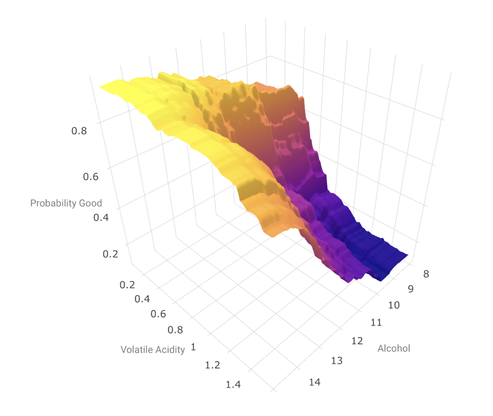

# Introduction to Machine Learning

This document covers machine learning basics.  The focus is on concepts and general approaches, with demonstration in R, though examples can be found for Python as well.  The background assumed for the reader is generally one that will have had more or less traditional/applied training with regression modeling, but little else is assumed beyond that.  R background can be fairly minimal, as there is no attempt to teach programming skills, but you should be familiar with basic data processing and analysis. 

It has gone through an update in 2018 and serves as the basis for a workshop.  [LINK TO DOC](http://m-clark.github.io/introduction-to-machine-learning/)

Contents include:

- An introduction to get used to terminology and tie things to common methods
- A focus on concepts, such as regularization and the bias-variance trade-off
- Examples including regularized regression, random forests, neural nets, and more
- An overview of extensions and ties to other methods
- A couple Python demos for the same methods

